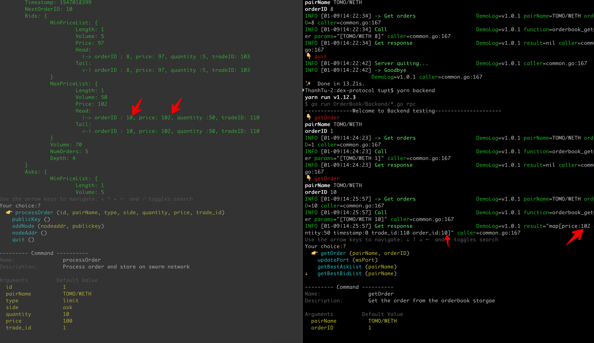

# DEX protocol POC using p2p programming in go-ethereum and leveldb storage

There are 2 parts, orderbook matching engine and orderbook protocol.

## USING THESE EXAMPLES

These code use the go-ethereum library  
You need to run `./install-requirements.sh` to install all required libraries

you can run demo node with orderbook protocol using engine and check result via RPC call.

## ISSUES

'sys/un.h' not found  
run this `open /Library/Developer/CommandLineTools/Packages/macOS_SDK_headers_for_macOS_10.14.pkg`
